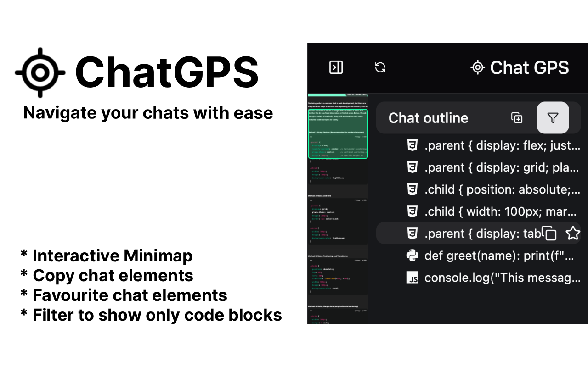

# Scroll Minimap for ChatGPT

[](https://chromewebstore.google.com/detail/scroll-minimap-for-chatgp/apekbedjllgmacohbcckgipfhjddehkf)


I made this extension because I kept getting lost during my conversations with chatgpt. Sometimes chatgpt be giving you alot of useless info you didnt ask for. Navigating through what it says and finding the useful bits can be pretty tedious. This extension aims to solve that.

[Documentation/notes](https://aebel-shajan.github.io/notes/projects/scroll-minimap-for-chatgpt/)


## Usage
1. Download the extension from [Chrome web store](https://chromewebstore.google.com/detail/scroll-minimap-for-chatgp/apekbedjllgmacohbcckgipfhjddehkf)

2. Restart chrome

3. Go to chatgpt, you should see a toggle button for the minimap in the top right corner. Open the minimap by pressing this button.

4. Ask chatgpt a message and hit refresh minimap. A condensed view of the conversation should be shown in the minimap.


## React learning notes
This project really tested my understanding of what react does under the hood.
## Hooks
react hook | Use
-|-
useState | Stores variable in component which persists across component rerenders
useEffect | Runs on every component rerender. Can pass in an array of state dependencies. This allows it to only run when the component rerenders and when the state provided is also different
useRef | This is like useState in that it persists across component rerenders. However change in the refs value does not trigger a rerender like useState does. This 
useMemo | This is only to be used with calculations that can impact performance. In this project, rendering the minimap image from html2canvas was very computationaly expensive. As a result I had to make sure to only rerender when it was necessary and not when other irrelavent pieces of state changed. 


* When we talk about rerender, we are talking about rerenders that take place in the virtual dom. React has an efficient algorithm to translate only the required changes to the real dom.
* **When the parent rerenders, the children will always rerender unless it is memoized.**
* **When state changes, the component the state is in will rerender.**
* **Change in props do not always trigger a rerender.**
  * (only when the props being passed in are states. In that case the state changing results in the parent to rerender. When parents rerender, this will trigger rerender of children recursively)
  * Example: 
    ```javascript
    function ParentComponent() {
    const myRef = React.useRef(0);

    const changeRefValue = () => {
      myRef.current = 42; // This does not trigger a re-render
    };

    return (
      <div>
        <button onClick={changeRefValue}>Change Ref Value</button>
        <ComponentX refProp={myRef} />
      </div>
    );
    }

    function ComponentX({ refProp }) {
    console.log("Component X renders");
    return <div>Ref current value: {refProp.current}</div>;
    }
    ```
    Here the change in the refprop does not trigger a rerender of Component X.
  * Dont listen to people online who are like `"React triggers re-rendering when there’s a change in state or props.🤓"` dumb. There are sooo many sites which parrot this line, its annoying 😭😭
  * Good explanation here https://www.joshwcomeau.com/react/why-react-re-renders/#its-not-about-the-props-2
  * In summary **props have nothing to do with re-renders**

